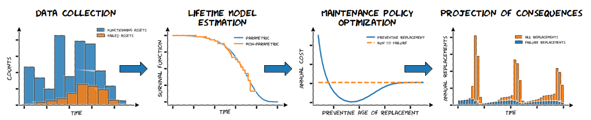

<p align="center">
  
</p>

<h2 align="center">
An open-source Python library for asset management
<h2 align="center">

<p align="center">
  
</p>


## Documentation

It is available at https://rte-france.github.io/relife/.
Some explanations might be missing until we finish it properly, so do not hesitate to open an issue.

## Installation (PyPi)

```bash
$ pip install relife
```
**Developer installation**

```bash
$ pip install ".[dev]"
```
Optionally, use the editable mode :

```bash
$ pip install -e ".[dev]"
```

## Installation (from source)

```bash
git clone https://github.com/rte-france/relife.git
cd relife
pip install .
```

## Citing

```
@misc{relife,
    author = {T. Guillon},
    title = {ReLife: a Python package for asset management based on reliability theory and lifetime data analysis.},
    year = {2022},
    journal = {GitHub},
    howpublished = {\url{https://github.com/rte-france/relife}},
}
```

## Credits

- The documentation uses [pydata-sphinx-theme](https://github.com/pydata/pydata-sphinx-theme) project. Original license
is [here](doc/LICENSE.txt)
- Some parts of the documentation are highly inspired by [Scikit-learn](https://scikit-learn.org/stable/), [Scipy](https://scipy.org/) and [NumPy](https://numpy.org/)
