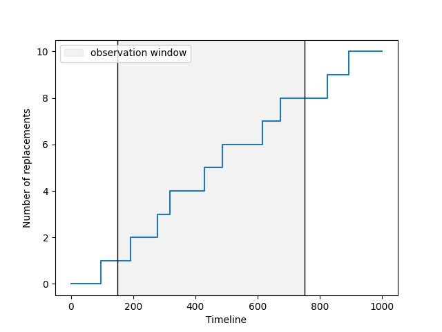
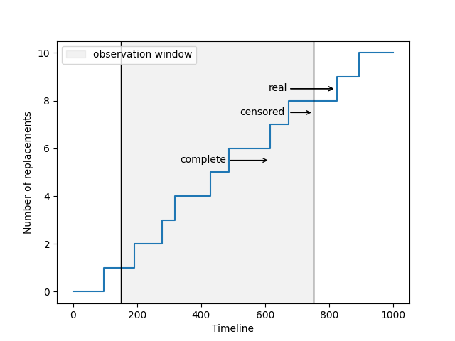

:html_theme.sidebar_secondary.remove:

Lifetime data
=============

In this section, you’ll learn more about the different categories of
lifetime data. We will use ReLife code snippets to illustrate these
concepts.

The basic situation
^^^^^^^^^^^^^^^^^^^

To begin, we will start with a basic situation to help you form a mental
image of what we are interested in.

.. image:: lifetime_data_cell1.png
    :align: center

What you see is a beautiful step plot that illustrates the evolution of
a number over time. This number represents the count of how many times
an asset has been replaced. At time zero (the first time the asset was
installed), no replacements have occurred yet. We had to wait
approximately 95 years to see the first replacement. From that moment
on, the asset is immediately replaced by a new one. We wait again, and
it is replaced once more. This process continues, with the asset being
replaced repeatedly over time.

One important thing to notice is that the time between each replacement
**is not constant; it varies!** For instance, after the replacement that
occurred after approximately 230 years, we only waited about 40 years to
replace it again. This raises a question: how can I know how much time
I’ll have to wait before the asset needs to be replaced?

To answer that question, you need to collect real-world values of
durations before the asset was replaced and conduct a statistical
analysis. ReLife can assist you in performing this statistical analysis.
Now, we will focus on how to collect data!

First data sample
^^^^^^^^^^^^^^^^^

Once again, we will use the previous plot to illustrate our point and
add other pieces of code. For now, just focus on the results, and don’t
worry about the code itself, as it will be explained in the upcoming
sections.

Imagine that in the real world, a very conscientious person has reported
every moment when an asset was replaced and provided you with the graph
above. From this graph, you can read the durations between each
replacement. The values are:

.. parsed-literal::

    [ 96.4439561   95.09262839  86.96249679  39.9442497  111.68409051
      55.51529933 129.10066294  58.24248363 150.7702303   69.45876827
     106.78513404]

The observation window
^^^^^^^^^^^^^^^^^^^^^^

Something may have crossed your mind. In the real world, it is highly
unlikely that someone started reporting these values from the very
beginning. Consequently, if someone provides you with data, there is
little chance that the duration values will be reported starting from 0.
Similarly, we chose an upper time limit of 1000. We all understand that
this upper time limit exists because we cannot collect data
indefinitely. But does this not truncate the last duration? We collected
106, but is this the real value? In other words, is the duration
complete? What if the actual duration is more than 106? This is
certainly possible, as we collected durations up to 150!

Here, 0 and 1000 define what we call **the observation window**, and as
we will see, this information is crucial for correctly interpreting the
durations we collected. To illustrate this point, let’s consider that in
our example, the real observation window is (150, 750).

Complete vs. censored data
^^^^^^^^^^^^^^^^^^^^^^^^^^

As you began to understand in the previous paragraph, the last duration
is not **complete**. This is clearly illustrated in the graph above.
This means that this value does not reflect the true duration. If you do
not take this information into account, **you’ll introduce errors** in
your analysis. We refer to this situation as **right censoring**: the
observed duration underestimates the actual duration.

Truncation
^^^^^^^^^^

The above plot requires one more piece of information. Like the last
duration, the first duration is affected by the lower bound of the
observation window, but in this case, we have actually observed the
event. Furthermore, the person who reported the values knew the age of
the asset when he began collecting data. Therefore, he reported a
duration until the event that is accurate because he truly observed the
event. However, he also knew that the asset was a certain age at that
time. This age defines a **left truncation**.

.. image:: lifetime_data_cell5.png
    :align: center

.. code:: ipython3

    fig, ax = plt.subplots()
    timeline, nb_events = sample.nb_events()

    sample.plot.nb_events(ax=ax, label=None)
    ax.set_xlabel("Timeline")
    ax.set_ylabel("Number of replacements")
    ax.vlines(150, 0, 1, transform=ax.get_xaxis_transform(), colors="black", linewidth=1.)
    ax.vlines(750, 0, 1, transform=ax.get_xaxis_transform(), colors="black", linewidth=1.)
    ax.axvspan(150, 750, alpha=0.1, color='gray', label="observation window")
    ax.annotate("", xytext=(672.98, 7.5), xy=(750, 7.5), arrowprops=dict(arrowstyle="->"), color="red")
    ax.text(610, 8.4, "real")
    ax.text(520, 7.4, "censored")
    ax.text(335, 5.4, "complete")
    ax.text(155, 0.4, "truncation")
    ax.annotate("", xytext=(672.98, 8.5), xy=(820, 8.5), arrowprops=dict(arrowstyle="->"))
    ax.annotate("", xytext=(672.98, 8.5), xy=(820, 8.5), arrowprops=dict(arrowstyle="->"))
    ax.annotate("", xytext=(485.64, 5.5), xy=(614.74, 5.5), arrowprops=dict(arrowstyle="->"))
    ax.annotate("", xytext=(96.44, 0.5), xy=(150, 0.5), arrowprops=dict(arrowstyle="->"))
    # ax.hlines(8.5, xmin=672.98, xmax=750, color="red", linewidth=1.5)
    # ax.hlines(7.9, xmin=672.98, xmax=750, color="green", linewidth=1.5)
    ax.legend()
    plt.show()
    plt.savefig("lifetime_data_cell5.png")

The value of the truncation must also be collected, as it provides
crucial information for estimating the probability of replacement after
a certain time. You can agree that a brand new asset and an asset that
is already 50 years old do not have the same probability of being
replaced, as the former is younger than the latter. Intuitively, what
you are doing is a **conditional probability computation**: you adjust
the probability of the asset being replaced based on its current age.

Is it really important ?
^^^^^^^^^^^^^^^^^^^^^^^^

Oh I see, you’re not really convinced that those details matter. You
argue that, maybe, if we have enough complete values, the errors will be
negligeable. That’s not true, it’s a false intuition. I’ll try to
illustrate that.

Let’s consider two scenarios. In the first, you did what you thought and
you stated that all values within the observation window are complete.
In the second scenario, you took care of what you read previously.

Now you conduct two statistical analysis. Remember, we want to know how
much time we have to wait before the asset needs to be replaced. I need
to be more precise about what we have called “statistical analysis”.
More precisely, here you actually want to estimate the underlying
probability distribution of the asset lifetime. If you know this
distribution, you can estimate the chance for the asset to be replaced
over the time. As I said, ReLife can do that. You’ll learn more about
this in the next section

Summing up
^^^^^^^^^^

Other observation biases and truncations
^^^^^^^^^^^^^^^^^^^^^^^^^^^^^^^^^^^^^^^^