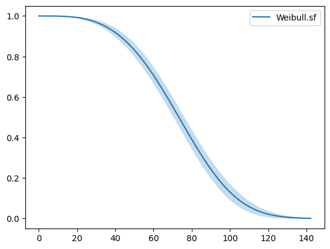

Data collection
~~~~~~~~~~~~~~~

In real life, you may have collected your own data but ReLife also
provides built-in datasets so that you can start learning ReLife. For
this example, we will use the *power transformer dataset*. If you don’t
know what a power transformer is, you can look at `the decicated
Wikipedia page <https://en.wikipedia.org/wiki/Transformer>`__ To load
this dataset, you must import the function ``load_power_transformer``

.. code:: ipython3

    from relife.data import load_power_transformer
    data = load_power_transformer()

Here ``data`` is a `structured
array <https://numpy.org/doc/stable/user/basics.rec.html%3E>`__ object
that contains three fields :

-  ``time`` : the observed lifetime values
-  ``event`` : the event indicators tagging each observations as
   complete (``True``) or censored (``False``)
-  ``entry`` : the left truncation values

.. code:: ipython3

    print(data["event"])
    print(data["event"])
    print(data["entry"])

.. parsed-literal::

    [ True  True  True ... False False False]
    [ True  True  True ... False False False]
    [34. 44. 52. ...  0.  0.  0.]

Lifetime model estimation
~~~~~~~~~~~~~~~~~~~~~~~~~

For the obtained data you can fit a lifetime model. In this example, we
use a simple lifetime model : a Weibull lifetime distribution.

.. code:: ipython3

    from relife.lifetime_model import Weibull
    weibull = Weibull()
    weibull.fit(
        data["time"],
        event=data["event"],
        entry=data["entry"],
    )
    print(weibull.params_names, weibull.params)

.. parsed-literal::

    ('shape', 'rate') [3.46597396 0.0122785 ]

Note that these model objects hold \`\ ``params`` values and that the
``fit`` has modified them inplace.

.. code:: ipython3

    weibull.plot.sf()

.. parsed-literal::

    <Axes: >

Maintenance policy optimization
~~~~~~~~~~~~~~~~~~~~~~~~~~~~~~~

Now let’s consider that we want the study an age replacement policy. You
need to know :

-  the cost of a preventive replacement :math:`c_p`
-  the cost of an unexpected failure :math:`c_f`
-  the current ages of your assets

For this example, we will fix :math:`c_p` at 3 millions of euros and
:math:`c_f` at 11 millions of euros. For the sake of the illustration,
we will sample 1000 age values for a binomial distribution to represent
the current ages of the assets. So here, we consider **a fleet of 1000
assets**.

.. code:: ipython3

    import numpy as np
    cp = 3. # cost of preventive replacement
    cf = 11. # cost of failure
    a0 = np.random.binomial(60, 0.5, 1000) # asset ages

Now you can use these values with the previous lifetime model to
optimize an age replacement policy

.. code:: ipython3

    from relife.policy import AgeReplacementPolicy
    policy = AgeReplacementPolicy(
        weibull,
        cf=cf,
        cp=cp,
        a0=a0,
        discounting_rate=0.04,
    ).optimize()

The obtained object encapsulates two age replacement arrays of 1000
values (because we considered 1000 assets). These data are stored in
``ar1`` for the first ages of replacements and ``ar`` for every next
ages of replacement. You can print them.

.. code:: ipython3

    print(policy.ar1.shape)
    print(policy.ar1[:5])
    print(policy.ar.shape)
    print(policy.ar[:5])

.. parsed-literal::

    (1000,)
    [29.79427714 28.42187901 27.08888713 31.92366325 37.19567492]
    (1000,)
    [59.19751205 59.19751205 59.19751205 59.19751205 59.19751205]

Projection of consequences
~~~~~~~~~~~~~~~~~~~~~~~~~~

Now that we a optimized an age replacement policy, we can project the
consequences of this strategy. For instance, you can be interested in
seeing the expected number of replacements and number of failures for
the next 170 years.

.. code:: ipython3

    nb_years = 170
    timeline, nb_replacements, nb_failures = policy.annual_number_of_replacements(nb_years, upon_failure=True)
    %timeit policy.annual_number_of_replacements(nb_years, upon_failure=True)

.. parsed-literal::

    644 ms ± 12.7 ms per loop (mean ± std. dev. of 7 runs, 1 loop each)

To do that, ReLife solves the renewal equation.

.. code:: ipython3

    print(timeline.shape)
    print(nb_replacements.shape)
    print(nb_failures.shape)

.. parsed-literal::

    (170,)
    (170,)
    (170,)

The returned objects are arrays of with 170 values, one value for each
upcoming years. Here, ReLife does not offer built-in plot
functionnalities. But of course, you can use
`matplotlib <https://matplotlib.org/>`__ code to represent these values
in one graph

.. code:: ipython3

    import matplotlib.pyplot as plt
    
    fig, ax = plt.subplots(figsize=(18, 5),  dpi=100)
    ax.bar(timeline + 2025, nb_replacements, align="edge", width=1., label="total replacements", color="C1", edgecolor="black")
    ax.bar(timeline + 2025, nb_failures, align="edge", width=1., label="failure replacements", color="C0", edgecolor="black")
    ax.set_ylabel("Number of annual replacements", fontsize="xx-large")
    ax.set_xlabel("Year", fontsize="xx-large")
    ax.set_ylim(bottom=0)
    ax.set_xlim(left=2025, right=2025 + nb_years)
    ax.legend(loc="upper right", fontsize="xx-large")
    plt.grid(True)
    plt.show()

.. image:: output_23_0.png

