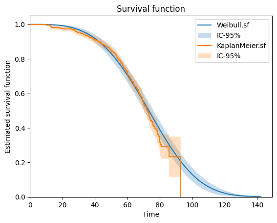

Basics
======

The section will help you understand basic commands of ReLife and its usage workflow.

A starter example
-------------------

.. figure:: images/relife_workflow.png
    :align: center

    The ReLife's workflow : from data collection to policy consequences

The figure above represents the four elementary steps of ReLife's workflow (for left to right) :

1. You collect failure data.
2. You fit a lifetime model from the data.
3. You create a maintenance policy (preventive age replacement or run-to-failure).
4. You can project the consequences of the policy (e.g. the expected number of annual replacements).

Data collection
^^^^^^^^^^^^^^^

ReLife provides built-in datasets so that you can start using the library and understand data structures. For this example,
we will use the *power transformer dataset*. If you don't know what a power transformer is, you can look at `the decicated Wikipedia page <https://en.wikipedia.org/wiki/Transformer>`_

.. code-block:: python

    >>> from relife.data import load_power_transformer
    >>> data = load_power_transformer()

Here ``data`` is a `structured array <https://numpy.org/doc/stable/user/basics.rec.html>`_ that contains three fields :

- ``time`` : the observed lifetime values.
- ``event`` : boolean values indicating if the event occured during the observation window.
- ``entry`` : the ages of the assets at the beginning of the observation window.

.. code-block:: python

    >>> print(data["time"])
    [34.3 45.1 53.2 ... 30.  30.  30. ]
    >>> print(data["event"])
    [ True  True  True ... False False False]
    >>> print(data["entry"])
    [34. 44. 52. ...  0.  0.  0.]

Lifetime model estimation
^^^^^^^^^^^^^^^^^^^^^^^^^

From the data you can fit a lifetime model. It may be a good idea to start with a non-parametric model like a Kaplan-Meier estimator.

.. code-block:: python

    >>> from relife.lifetime_model import KaplanMeier
    >>> kaplan_meier = KaplanMeier()
    >>> kaplan_meier.fit(
          data["time"],
          event=data["event"],
          entry=data["entry"],
        )
    <relife.lifetime_model.non_parametric.KaplanMeier at 0x732a2f85db90>

You can quickly plot the estimated survival function

.. code-block:: python

    >>> kaplan_meier.plot.sf()

.. image:: images/kaplan_meier.png

Then, you can fit a parametric lifetime model and plot the two survival functions obtained in one graph.

.. code-block:: python

    >>> from relife.lifetime_model import Weibull
    >>> weibull = Weibull()
    >>> weibull.fit(
          data["time"],
          event=data["event"],
          entry=data["entry"],
        )
    >>> print(weibull.params_names, weibull.params)
    ('shape', 'rate') [3.46597396 0.0122785 ]

Note that this object holds ``params`` values and the ``fit`` method has modified them inplace.

.. code-block:: python

    >>> weibull.plot.sf()
    >>> kaplan_meier.plot.sf()

Maintenance policy optimization
^^^^^^^^^^^^^^^^^^^^^^^^^^^^^^^

Let's consider that we want the study an age replacement policy. You need to choose :

- costs of a preventive replacement :math:`c_p`
- costs of an unexpected failure :math:`c_f`

For this example, we will set :math:`c_p` at 3 millions of euros and :math:`c_f` at 11 millions of euros.
Note that this cost structure also takes into account any undesirable consequences of the asset replacement and that :math:`c_f` is higher than :math:`c_p`.
We sample 1000 ages from a binomial distribution to represent the current ages of a flit of 1000 assets.

.. code-block:: python

    >>> import numpy as np
    >>> cp = 3. # cost of preventive replacement
    >>> cf = 11. # cost of failure
    >>> a0 = np.random.binomial(60, 0.5, 1000) # asset ages

We can use these values with the previous lifetime model to optimize an age replacement policy

.. code-block:: python

    >>> from relife.policy import AgeReplacementPolicy
    >>> policy = AgeReplacementPolicy(
          weibull,
          cf=cf,
          cp=cp,
          a0=a0,
          discounting_rate=0.04,
        ).optimize()

The obtained object encapsulates optimal ages of replacement ``ar`` in one array of 1000 values (because we considered 1000 assets). We can also get the time before the first replacement
by requesting ``tr1``. Here, note that the optimal ages of replacement are the same for each asset because the costs are the same for each of them (but you can also pass arrays of cost values if you want).

.. code-block:: python

    >>> print("Optimal ages of replacement (per asset)", policy.ar[:5])
    Optimal ages of replacement (per asset) [59.19751205 59.19751205 59.19751205 59.19751205 59.19751205]
    >>> print("Current asset ages", policy.a0[:5])
    Current asset ages [31 30 25 27 32]
    >>> print("Time before the first replacement (per asset)", policy.first_cycle_tr[:5])
    Time before the first replacement (per asset) [28.19751205 29.19751205 34.19751205 32.19751205 27.19751205]

Projection of consequences
^^^^^^^^^^^^^^^^^^^^^^^^^^

We can project the consequences of our policy, e.g. the expected number of replacements and number of failures for the next 170 years.

.. code-block:: python

    >>> nb_years = 170
    >>> timeline, nb_replacements, nb_failures = policy.annual_number_of_replacements(nb_years, upon_failure=True)

To do that, ReLife solves **the renewal equation**. The returned objects are arrays of with 170 values, one value for each upcoming years.

.. code-block:: python

    >>> print(timeline.shape)
    (170,)
    >>> print(nb_replacements.shape)
    (170,)
    >>> print(nb_failures.shape)
    (170,)

Here, ReLife does not offer built-in plot functionnalities. But of course, you can use `Matplotlib <https://matplotlib.org/>`_ code to represent these values in one graph.

.. code-block:: python

    >>> import matplotlib.pyplot as plt
    >>> fig, ax = plt.subplots(figsize=(18, 5),  dpi=100)
    >>> ax.bar(timeline + 2025, nb_replacements, align="edge", width=1., label="total replacements", color="C1", edgecolor="black")
    >>> ax.bar(timeline + 2025, nb_failures, align="edge", width=1., label="failure replacements", color="C0", edgecolor="black")
    >>> ax.set_ylabel("Number of annual replacements", fontsize="x-large")
    >>> ax.set_xlabel("Year", fontsize="x-large")
    >>> ax.set_ylim(bottom=0)
    >>> ax.set_xlim(left=2025, right=2025 + nb_years)
    >>> ax.legend(loc="upper right", fontsize="x-large")
    >>> plt.grid(True)
    >>> plt.show()

.. image:: images/number_of_replacements.png

ReLife and Numpy
----------------

ReLife is built using `NumPy <https://numpy.org/>`_, a fundamental Python library for numerical computing.
While you don't need to be a NumPy expert, understanding its basics will help since ReLife often requires data input of type ``np.ndarray``

There are 3 standard representations of data in ReLife :

- If you want to pass a scalar value, then use a ``float``
- If you want to pass a vector of :math:`\mathbb{R}^n`, i.e. :math:`n` values for one asset, then use a ``np.ndarray`` of shape ``(n,)``
- If you want to pass a matrix of :math:`\mathbb{R}^{m\times n}`, i.e. :math:`n` values for :math:`m` assets, then use a ``np.ndarray`` of shape ``(n,)``

**Broadcasting examples**

Here we create a very simple lifetime model (a lifetime distribution) called Weibull. To demonstrate input/output logic, we will begin with a ``float`` input. Here
we want to compute :math:`P(T > 40)`, the survival function evaluated in 40.

.. code-block:: python

    >>> from relife.lifetime_model import Weibull
    >>> weibull = Weibull(3.47, 0.012)
    >>> weibull.sf(40.)
    np.float64(0.9246627462729304)

The output has the same number of dimension than the input. It is a float-like object called ``np.float64`` that is compatible
with the NumPy interface. For instance, this object can answer to ``.ndim`` and ``.shape`` requests. Here it would be ``0`` and ``()``.

Now, imagine that you want to compute not only :math:`P(T > 40)`, but also :math:`P(T > 50)` and :math:`P(T > 60)`. Because ReLife is built on NumPy, it benefits from
a concept called `broadcasting <https://numpy.org/doc/stable/user/basics.broadcasting.html>`_. It provides a way to vectorize operations so that the three evaluations of the survival function
are computed in parallel. To do that, you need to pass a ``np.ndarray`` that encapsulate all your input values.

.. code-block:: python

    >>> import numpy as np
    >>> weibull.sf(np.array([40., 50., 60.])) # 1d array of shape (3,)
    array([0.92466275, 0.84375201, 0.72625935])

Note that the input is a ``np.ndarray`` of 1 dimension with a shape of ``(3,)``. The output is consistent to the input and has the same shape. This logic is extended **until
two dimensions**. With ReLife, asset managers may be interested to compute values on a fleet of assets. In this scenario, it is sometimes usefull to **pass several values per
assets.**

.. code-block:: python

    >>> weibull.sf(np.array([[40., 50., 60.], [42., 55., 68.]])) # 2d array of shape (2, 3)
    array([[0.92466275, 0.84375201, 0.72625935],
           [0.91139796, 0.78939177, 0.61029328]])

Note that the input is a ``np.ndarray`` of 2 dimensions with a shape of ``(2, 3)``. Each row **is like a vector of values for each assets**. Here the number of assets is 2.
The output shape is consistent to the input.

Variables dimensions
--------------------

Some Numpy data passed to ReLife functions cannot have any number of dimension. They try to correspond to a coherent math representation.

**ReLife does not control the dimension and the shapes or your data**. We believe that the user is responsible and must know what he's doing.
That's why **you must be carefull to the way you encode your data in Numpy objects**. In this section, we provide a currated list of all possible encodings per input data and their possible shapes.

.. list-table:: Numpy encodings
    :header-rows: 1

    * - name
      - shape
      - dim
      - details
    * - ``time``
      - ``()``, ``(n,)`` or ``(m, n)``
      - 0, 1 or 2
      - ``n`` is the number of values and ``m`` is the number of assets
    * - ``a0``
      - ``()`` or ``(n,)``
      - 0 or 1
      -
    * - ``ar``
      - ``()`` or ``(n,)``
      - 0 or 1
      -
    * - ``covar``
      - ``()``, ``(k,)`` or ``(m, k)``
      - 0, 1 or 2
      - ``k`` is the number of regression coefficients

