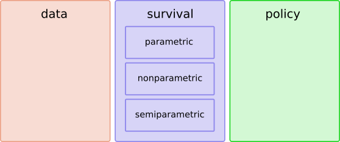
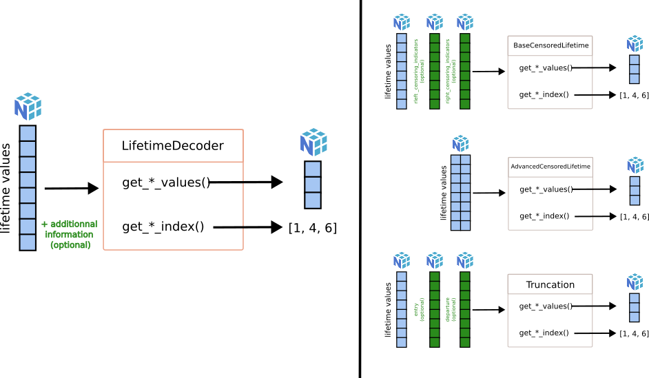
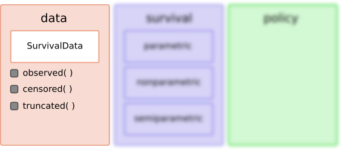

# 1. ReLife2



ReLife2 is composed of three modules:

- `data` : it contains all necessary objects to load data used in ReLife2
- `survival`: it contains all objects used for survival analysis workflow. This module is composed of three submodules `parametric`, `nonparametric` and `semiparametric`  
- `policy`: it contains all objects used for reliability theory and renewal theory


# 2. `data` module

The `data` module is composed of several objects. For a basic usage, one can only focus on the `SurvivalData` dataclass (see section below). For contributors, please make sure you understand the `LifetimeDecoder` family section before.

## `LifetimeDecoder` family

To understand how `SurvivalData` dataclass works, it is necessary to know the [`decoder` submodule](../relife2/data/decoder.py). It contains objects that decodes lifetime data. Why ? Survival analysis carries on lifetime data whose format may not be constant. Our `LifetimeDecoder` objects share the same setup and their role is to extract all necessary information from given lifetime data. Everyone can propose a new decoder if a new lifetime data format is needed. For now, there are three decoder implementations :

- [`BaseCensoredLifetime`](../relife2/data/decoder.py#L59)
- [`AdvancedCensoredLifetime`](../relife2/data/decoder.py#L117)
- [`Truncation`](../relife2/data/decoder.py#L171)



As you can see, every `LifetimeDecoder` implements `get_*_values()` and `get_*_index()` methods. Here `*` means either left, right, interval or regular. It is just getter methods returning either lifetime values or index. The following table describes more precisely what it means for each implemented decoders

| |`get_*_values`()|`get_*_index`()|
|-|-|-|
|`BaseCensoredLifetime`|return left-right-interval censored or regular (observed) lifetime values|return left-right-interval censored or regular (observed) lifetimes index|
|`AdvancedCensoredLifetime`|return left-right-interval censored or regular (observed) lifetime values|return left-right-interval censored or regular (observed) lifetimes index|
|`Truncation`|return left-right-interval truncation values or regular (not truncated) lifetime values|return left-right-interval truncated or regular (not truncated) lifetimes index|

Because one user doesn't want to know all the decoders, their instanciations are handled by two factories :  [`censoredlifetimes_decoder`](../relife2/data/decoder.py#L261) and [`truncations_decoder`](../relife2/data/decoder.py#L278).

**Want to contribute ? :** at this step, you may noticed that this code structure allows every one to add its own `LifetimeDecoder`. To do so, please make sure that your decoder object inherits from [`LifetimeDecoder`](../relife2/data/decoder.py#L6). It is necessary that every decoder shares the same structure to be used in our dataclass object (see next section). You might also extend current factories to return your decoder. 


## `SurvivalData` dataclass

Previous decoder objects serve [`SurvivalData` dataclass](../relife2/data/base.py#L10). They fuel this dataclass attributes. As all decoders share the same structure, the initialization of the dataclass must not change. Only extensions are allowed.




`SurvivalData` dataclass proposes three main methods allowing to access rapidly to lifetime information in a more intelligibly manner :

- `.observed(return_values=False)` : return observed lifetime index (or values if `return_values=True`).
- `.censored(how="left", return_values=False)`: return censored lifetime index (or values if `return_values=True`). `how` can be either left, right and interval.
- `.truncated(how="left", return_values=False)`: return truncated lifetime index (or values if `return_values=True`).`how` can be either left, right and interval.

**Example:**
```python
import numpy as np
from relife2 import SurvivalData

time = np.random.randint(10, high=50, size=100)
event = np.random.randint(0, 2, size=100)
data = SurvivalData(time, event=event)

>>> data.info()

     Lifetime data            Counts
              Tot.               100
          Observed                51
     Left censored                49
    Right censored                 0
 Interval censored                 0
    Left truncated                 0
   Right truncated                 0
Interval truncated                 0

>>> data.observed(return_values=True)

np.array([30 35 17 10 38 23 26 27 29 21 23 14 21 17 27 19 23 49 46 12 13 49 10 14 ...])

>>> data.censored(how="right", return_values=True)

np.array([44 35 22 48 48 23 34 15 16 35 35 38 34 29 24 33 26 20 38 23 13 12 23 ..])
```

For more examples, take a look at [this notebook](../examples/data_examples.ipynb) in the [examples folder](../examples/)


## Future developments ?

With this code structure, one may imagine new decoders, new dataclass and even new modules. An interesting one could be a `reader` module which implements reader objects. Their role would be to read different file formats (.csv, .xml, etc.) containing lifetime values and load their content in `np.ndarray` object. We could create a synergy between `reader` and `decoder` so that a user can load lifetime time values from files and put it in our `SurvivalData` dataclass automatically. 

# 3. `survival` module