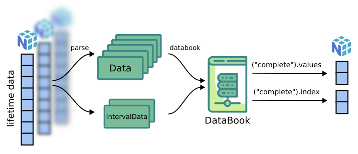

The databook object
===========================

.. role:: python(code)
   :language: python

ReLife models use the ``DataBook`` object internally to manipulate lifetime data. As a book, it holds
every lifetime data information provided by user. It controls data integrity : are lifetimes censored 
and complete at the same time ? Is lifetime data format respected ? It also allows us to explore data in a convenient
way : get all complete lifetime values, get right censored lifetime values being left truncated, etc.

A databook is created as follow:

Instanciate a databook
----------------------
.. code-block:: python

    from relife2.data import databook

    first_db = databook(
        observed_lifetimes = first_data["observed_lifetimes"],
        right_censored_indicators = first_data["event"] == 0,
        complete_indicators = first_data["event"] == 1,
        entry = first_data["entry"],
    )

    second_db = databook(
        observed_lifetimes = second_data["observed_lifetimes"],
        entry = second_data["entry"],
        departure = second_data["departure"],
    )

As mentionned before, with 1d-array lifetimes, censored lifetimes must be explicitly
tagged through indicators. Here :python:`event` can serve both :python:`right_censored_indicators`
and :python:`complete_indicators`.

Databook exploration
--------------------

Now, lifetimes data can be explored very easily. For instance, one might want to get every
complete lifetimes. To do so just call:

>>> first_db("complete").values
np.array([10, 9, 11])

>>> second_db("complete").values
np.array([5, 10])

One can also get corresponding data index. Just replace :python:`.values` by :python:`.index`.

Databook can do more. One might wants to access lifetimes being complete **and** left truncated.
To do so, one can use the "and" operator as follow : 

>>> first_db("complete & left_truncated")[0].values
np.array([9, 11])

>>> first_db("complete & left_truncated")[1].values
np.array([3, 9])

The "or" operator can also be used. For instance :

>>> first_db("complete | left_truncated")[0].values
np.array([10, 9, 11])

The databook function instanciates a :python:`DataBook` object. This functions take
several arguments (see :doc:`../reference/data`) but it also allows extra 
key-words arguments like :

* :python:`observed` : :python:`Data` instance (default to :python:`None`)
* :python:`left_censored` : :python:`Data` instance (default to :python:`None`)
* :python:`right_censored` : :python:`Data` instance (default to :python:`None`)
* :python:`interval_censored` : :python:`IntervalData` instance (default to :python:`None`)
* :python:`left_truncated` : :python:`Data` instance (default to :python:`None`)
* :python:`right_truncated` : :python:`Data` instance (default to :python:`None`)
* :python:`interval_truncated` : :python:`IntervalData` instance (default to :python:`None`)

Thus, if one wants to use its own data format, it is possible by specifying one or all
of the above arguments.

.. :warning::
    To do, object passed as arguments must be a :python:`Data` or :python:`IntervalData`
    instance

:python:`Data` or :python:`IntervalData` objects share a similar interface with two attributes

*  :python:`values` (:python:`np.ndarray`) : values of lifetimes, shape is always :python:`(n,)` in :python:`Data` and always :python:`(n,2)` in :python:`IntervalData`
*  :python:`index` (:python:`np.ndarray`) : index of lifetimes, shape is always :python:`(n,)`

They are initialized thanks to a method called :python:`parse` that must always return a tuple :python:`(index, values)`.
Then, if a user wants to implement its own :python:`Data` (or :python:`IntervalData` object), he would
write its own class like this : 

.. code-block:: python

    from relife2.data.object import Data

    class MyCustomData(Data)
        def __init__(self, *data):
            super().__init__(*data)

        def parse(self, *data):
            # a personal parsing process
            return index, values

After that, he could pass this new :python:`Data` in the desired extra key-word argument of :python:`databook`