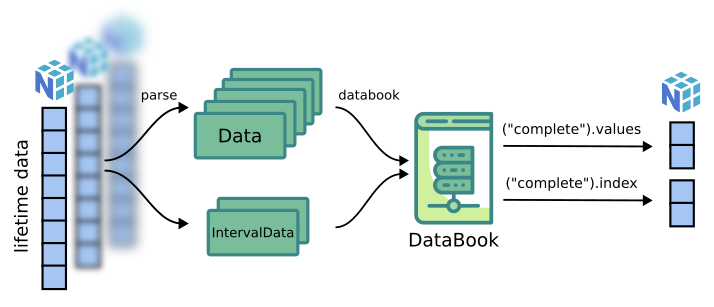

The databook object
===========================

.. role:: python(code)
   :language: python

ReLife models use the ``DataBook`` object internally to manipulate lifetime data. As a book, it holds
every lifetime data information provided by user. It controls data integrity : are lifetimes censored 
and complete at the same time ? Is lifetime data format respected ? It also allows us to explore data in a convenient
way : get all complete lifetime values, get right censored lifetime values being left truncated, etc. Thus, it fixes
data manipulations for contributors and makes the code more explicit.

DataBook instanciation
----------------------

``DataBook`` instances are made with ``databook`` factory. It controls lifetime data format inputs.

 
.. currentmodule:: relife2.survival.data

.. autoclass:: Data
    :members:
    :inherited-members:

.. code-block:: python

    import numpy as np
    from relife2.data import databook

    first_data = {
        "observed_lifetimes": np.array([10, 11, 9, 10, 12, 13, 11]),
        "event": np.array([1, 0, 1, 0, 0, 0, 1]),
        "entry": np.array([0, 0, 3, 5, 3, 1, 9]),
    }

   second_data = {
        "observed_lifetimes": np.array(
            [[1, 2], [0, 4], [5, 5], [7, np.inf], [10, 10], [2, 10], [10, 11]]
        ),
    }

    first_db = databook(
        observed_lifetimes = first_data["observed_lifetimes"],
        right_censored_indicators = first_data["event"] == 0,
        complete_indicators = first_data["event"] == 1,
        entry = first_data["entry"],
    )

    second_db = databook(
        observed_lifetimes = second_data["observed_lifetimes"],
        entry = second_data["entry"],
        departure = second_data["departure"],
    )

Databook manipulations
-----------------------

Lifetimes data can be manipulated very easily. For instance, one might want to get every
complete lifetimes. To do so just call:

>>> first_db("complete").values
np.array([10, 9, 11])

>>> second_db("complete").values
np.array([5, 10])

One can also get corresponding data index. Just replace :python:`.values` by :python:`.index`.

Databook can do more. One might wants to access lifetimes being complete **and** left truncated.
To do so, one can use the "and" operator as follow : 

>>> first_db("complete & left_truncated")[0].values
np.array([9, 11])

>>> first_db("complete & left_truncated")[1].values
np.array([3, 9])

The "or" operator can also be used. For instance :

>>> first_db("complete | left_truncated")[0].values
np.array([10, 9, 11])
