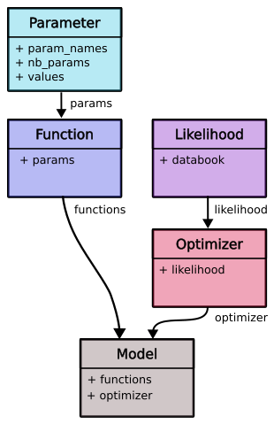

How to custom your survival model
=================================

.. role:: python(code)
   :language: python

In ReLife, every model is composed of two objects :

* ``functions`` : this object contains a ``parameter`` object and several methods that implements expected model's functions (hazard function, survival function, mean, etc.)
* ``optimizer``: this object contains a ``likelihood`` object instanciated with a ``databook``. It holds the ``fit`` method

A more global view of this structure is given in the following graph. 

Knowing that, one might think that it would be possible to define its own model by customizing
one or all objects composing a model. That's true as long as one respects every object interfaces !

To make it easier, in every :python:`relife2.survival` module, one can implement its custom model with
:python:`custom_*` like functions. For instance, if one wants to implement its own distribution,
``custom_distri`` function can be used. These functions specify required objects to custom
a specific type of model. Let's take the example of :python:`custom_distri` . It expects 3 arguments : 

* ``databook``
* ``functions``
* ``likelihood``

If you look at our documentation, you'll see that ``functions``
must be an object definition which inherits from ``ParametricDistriFunction`` and ``likelihood``
must be an object definition which inherits from ``ParametricDistriLikelihood``. 

.. note::
    The arguments type changes depending from which ``survival`` module the ``custom_*``
    function is.

In the case of parametric distribution, one could write the ``functions`` class as follow :

.. code-block:: python

    from relife2.survival.parametric.function import ParametricDistriFunction

    class MyFunction(ParametricDistriFunction)
        def __init__(self, nb_params = 4):
            super().__init__(nb_params)

        def hf(self, time: np.ndarray) -> np.ndarray:
            # for instance self.params[0] * np.ones_like(time)  
            pass

        def chf(self, time: np.ndarray) -> np.ndarray:
            pass

        def mean(self) -> np.ndarray:
            pass

        def var(self) -> np.ndarray:
            pass

        def mrl(self, time: np.ndarray) -> np.ndarray:
            pass

        def ichf(self, cumulative_hazard_rate: np.ndarray) -> np.ndarray:
            pass

        def isf(self, probability: np.ndarray) -> np.ndarray:
            pass

As you see, many methods must be explicitly defined for a distribution model. It is specific
for this type of model as the exact expression of these functions are well-known. For others
parametric model, it would not be the case and only ``hf`` and ``chf`` definitions would have
been required.

.. note::

    ``functions`` objects takes either ``nb_params`` and/or ``param_names`` at initialization.
    If one know paramater names, they can be passed as a  ``list`` in ``param_names``. Then,
    a parameter value can be called in methods with ``self.params.<param_name>``. Otherwise,
    one must a least specify the number of parameters. Then a parameter value is accessed by
    indexing on ``self.params``. In the example above, one could access the 3rd parameter
    value by calling ``self.params[2]``.

For ``likelihood``, it would look like :

.. code-block:: python

    from relife2.survival.parametric.likelihood import ParametricDistriLikelihood

    class MyLikelihood(ParametricDistriLikelihood)
        def __init__(self, databook: DataBook):
            super().__init__(databook)

        def jac_hf(self, time: np.ndarray) -> np.ndarray:
            # shape : (len(sample), nb_param)
            pass

        def jac_chf(self, time: np.ndarray) -> np.ndarray:
            # shape : (len(sample), nb_param)
            pass

As you can see, only the jacobian definitions of ``hf`` and ``chf`` is required. Again, this
is specific to parametric model as a generic expression of the likelihood is already implemented.
Arguments passed to these methods might also change depending on the needs. For instance, could take
``functions`` as argument.