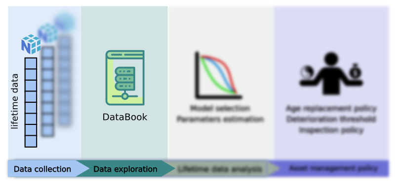

How to use databook
====================

.. role:: python(code)
   :language: python

One main object of ReLife is the ``DataBook``. It is used everywhere. As a book, it holds
every lifetime data information provided and allows users to explore data in a convenient
way : get all complete lifetime values, get right censored lifetime values being left truncated, etc.
Following previous section example, a databook is created as follow:

Instanciate a databook
----------------------

.. code-block:: python

    from relife2.data import databook

    first_db = databook(
        observed_lifetimes = 1d_data["observed_lifetimes"],
        right_censored_indicators = 1d_data["event"] == 0,
        complete_indicators = 1d_data["event"] == 1,
        entry = 1d_data["entry"],
    )

    second_db = databook(
        observed_lifetimes = 2d_data["observed_lifetimes"],
        entry = 2d_data["entry"],
        departure = 2d_data["departure"],
    )

As mentionned before, with 1d-array lifetimes, censored lifetimes must be explicitly
tagged through indicators. Here :python:`event` can serve both :python:`right_censored_indicators`
and :python:`complete_indicators`.

Databook exploration
--------------------

Now, lifetimes data can be explored very easily. For instance, one might want to get every
complete lifetimes. To do so just call:

.. code-block:: python

    first_db("complete").values

.. code-block:: python

    second_db("complete").values

These commands will return 1d-array containing complete lifetimes values. The first one
returns :python:`np.array([10, 9, 11])` and the latter returns :python:`np.array([5, 10])`.
One can also get corresponding data index. Just replace :python:`.values` by :python:`.index`.

Databook can do more. One might wants to access lifetimes being complete **and** left truncated.
To do so, one can use the "and" operator as follow : 

.. code-block:: python

    first_db("complete & left_truncated")

This command returns 2 objects which contain complete and left truncations values/index.
To access the values of complete lifetimes being left truncated, just call :

.. code-block:: python

    first_db("complete & left_truncated")[0].values

It must returns :python:`np.array([9, 11])`. Inversly, to get left truncations values of
complete lifetimes, call:

.. code-block:: python

    first_db("complete & left_truncated")[1].values

It must returns :python:`np.array([3, 9])`. The "or" operator can also be used. For instance :

.. code-block:: python

    first_db("complete | left_truncated")[0].values

It returns all complete lifetimes :python:`np.array([10, 9, 11])`.

Finally, a convenient method of databook is :python:`info`. It summarizes all the databook
content in one view :

.. code-block:: python

    first_db.info