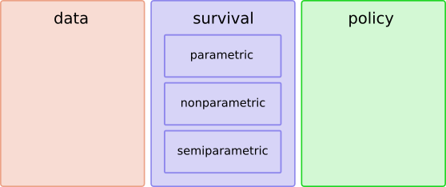

# Quick start

ReLife2 is composed of three modules:

- `data` : it contains all necessary objects to load data used in ReLife2
- `survival`: it contains all objects used for survival analysis workflow. This module is composed of three submodules `parametric`, `nonparametric` and `semiparametric`  
- `policy`: it contains all objects used for reliability theory and renewal theory