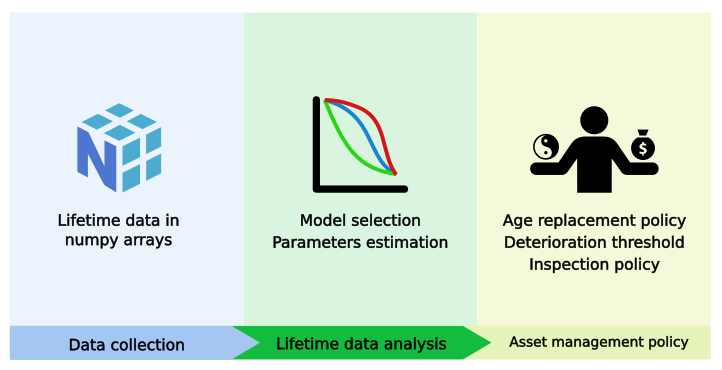

Quick start
===================

.. role:: python(code)
   :language: python

Data collection
---------------

First get lifetime data in `np.array <https://numpy.org/doc/stable/reference/generated/numpy.array.html>`_.
For instance :

.. code-block:: python
    
    import numpy as np

    observed_lifetimes = np.array([10, 11, 9, 10, 12, 13, 11])
    event = np.array([1, 0, 1, 0, 0, 0, 1])
    entry = np.array([0, 0, 3, 5, 3, 1, 9])

Here, ``observed_lifetimes`` are collected lifetimes, ``event`` is an indicator whose value is 1 
when lifetimes are complete observations but 0 when they are right censored. ``entry`` are left
truncation values.

.. seealso::
    For more details, please read :doc:`user_guide/data_collect`.

Lifetime data analysis
----------------------
    
Several survival models are available in ReLife. A curated list can be found in ... Every ReLife's
survival models are in the ``relife2.survival`` module and must be imported from there. For instance

.. code-block:: python
    
    from relife2.survival import exponential

    exp_dist = exponential(rate = 0.00795203)

Models can be fitted to given data using the ``fit`` method. For instance

.. code-block:: python
    
    exp_dist.fit(
        observed_lifetimes,
        complete_indicators = event == 1,
        right_censored_indicators = event == 0,
        entry = entry,
    )

Then, one can print the fitting parameters :

.. code-block:: python

    print(exp_dist.fitting_params)
    >>> Parameter 
        rate = 0.054545454630883686

For inference, just call the desired function method.

.. code-block:: python

    exp_dist.sf(np.linspace(1, 10, 5))
    >>> array([0.94691547, 0.83755133, 0.74081822, 0.65525731, 0.57957828])

.. seealso::
    For more details, please see :doc:`user_guide/survival`

Asset management policy
-----------------------
Coming soon

How to custom ReLife ?
----------------------

Some users may want to test their own implementations. We tried to make each ReLife
processes customizable. If you want to go deeper and test ReLife with your own data 
format and/or survival model please read : :doc:`contributor_guide/data` 
and :doc:`contributor_guide/survival`
