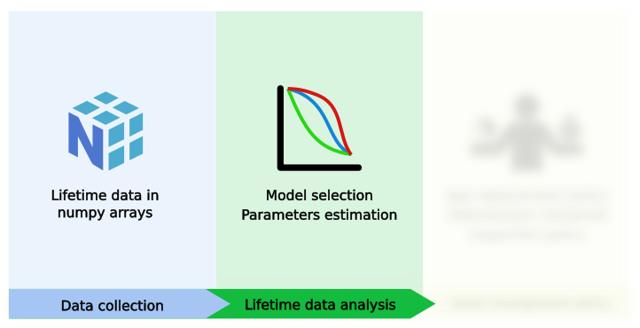

How to use survival model
==========================

.. role:: python(code)
   :language: python

Once you've loaded your data in the correct `np.array <https://numpy.org/doc/stable/reference/generated/numpy.array.html>`_ format, you're ready to use ReLife's models.
ReLife models are grouped in three modules :

* :python:`relife2.survival.parametric`
* :python:`relife2.survival.semiparametric`
* :python:`relife2.survival.nonparametric`

Every models can be imported from one of the three modules with :python:`from <module> import <model>`
For instance, one can catch the exponential distribution with :

.. code-block:: python

    from relife2.survival.parametric import exponential

Model instanciation
-------------------

Every ReLife's model shares the same structure. They are basically a model object composed of
a :python:`Function` instance holding :python:`Parameter` instance.

.. seealso::
    For more details, please read :doc:`../contributor_guide/survival`.

Every models have named parameters. When you instanciate a model, one can either give parameter
values through ``*args`` or ``**kwargs``. Obviously, number of given arguments must corresponds
to parameters' model number. If no parameter values are given, then model parameters are initialized
at random

.. code-block:: python
    
    exp_dist = exponential(rate = 0.00795203) # or just exponential(0.00795203)
    random_exp_dist = exponential()

Here ``exp_dist`` has fixed parameter whereas ``random_exp_dist`` has parameter initialized at random.

One may wants to see model's parameter at this step. Just print ``params`` :

.. code-block:: python

    print(exp_dist.params)
    >>> Parameter
        rate = 0.00795203

``params`` stores model's parameters in :python:`Parameter` instance. Parameters' values are stored in
the ``values`` attribute and can accessed with :

exp_dist.params.values
>>> np.array([0.00795203])

Parameters estimations
----------------------

If you want to estimate model's parameters, you have to call the :python:`fit` method.

.. code-block:: python
    
    random_exp_dist.fit(
        observed_lifetimes,
        complete_indicators = event == 1,
        right_censored_indicators = event == 0,
        entry = entry,
    )

After that, the model instance holds a :python:`fitting_params` and a :python:`fitting_results`
attribute. The former gives the values of fitting parameters. The latter stores information
about the estimations like the standard error derived from the information matrix.

Inference
---------

Once parameters have been estimated, one can call functions to obtain their corresponding values.
For instance : 

For inference, just call the desired function method. For instance : 

.. code-block:: python

    random_exp_dist.sf(np.linspace(1, 10, 5))
    >>> array([0.94691547, 0.83755133, 0.74081822, 0.65525731, 0.57957828])

Here, ``sf`` values are computed with fitting parameter because model has been fitted before.
One can still   override model's parameters by adding ``params`` key-word argument.

.. code-block:: python

    random_exp_dist.sf(np.linspace(1, 10, 5), params=0.005)
    >>> array([0.99501248, 0.98388132, 0.97287468, 0.96199118, 0.95122942])

.. code-block:: python

    sf_values = exponential_distri.sf(t, params = np.array([0.00795203]))

It will return the :python:`sf` values of :python:`t` for an exponential rate of 0.00795203.

.. warning::

    If model's parameters are initialized at random and model has not been fitted yet, calling
    a function without specifying ``params`` will raise an error encouraging you to fit the model first 
    or to specify parameters as above. 
